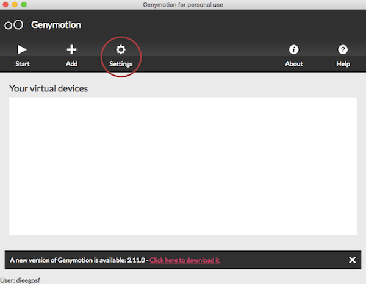
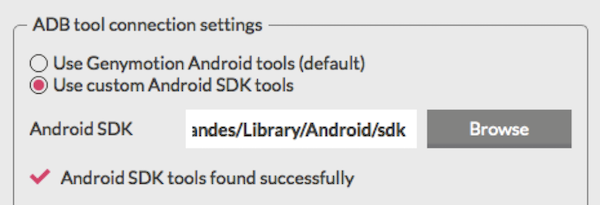
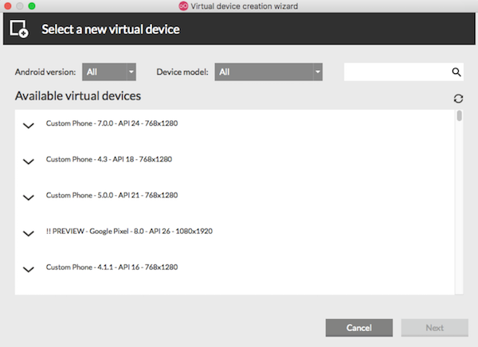
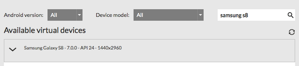
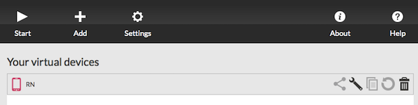

# Configurando Genymotion

Utilizaremos o Genymotion como emulador do Android. Escolhi o Genymotion pelo fato de ser mais estável e rápido, mas você pode escolher utilizar o emulador do Android Studio. Antes de instalar o Genymotion vamos instalar o VirtualBox. Para ambientes **Mac OSX ou Windows** acesse o link: https://www.virtualbox.org/wiki/Downloads

Para ambientes **Linux** basta executar o seguinte comando no terminal:
```sh
sudo apt-get install virtualbox
```

Agora vamos acessar o site https://www.genymotion.com/fun-zone/ e clicar no botão “Download Genymotion Personal Edition”. O Genymotion vai pedir que você crie uma conta na plataforma, realize esse processo e depois você poderá baixar o software

Agora, em ambientes Mac OSX ou Windows, basta instalar o software e abrí-lo através de seus executáveis.

Caso esteja no Linux precisamos realizar um processo a mais: extraia o arquivo .bin baixado do site do Genymotion em uma pasta de sua escolha e acesse-a via terminal. Acesse a pasta do arquivo extraído execute o seguinte comando:

```sh
chmod +x genymotion-2.2.2_x64.bin
./genymotion-2.2.2_x64.bin
```

***ATENÇÃO: Altere 2.2.2 pela versão do Genymotion que você baixou.***

Com isso o Genymotion será instalado em seu sistema e você já pode acessá-lo a partir da pasta de instalação. Por padrão a pasta que o Genymotion é instalado é “/home/[usuario]/genymotion/“. Acesse essa pasta pelo terminal e execute o seguinte comando para abrir o Genymotion:

```sh
./genymotion
```

Se tudo ocorreu bem, você verá uma tela como a seguinte:



Clique no botão “Settings” e na aba “Account” faça login com sua conta criada no site do GenyMotion.

Após realizado login, ainda no menu “Settings”, na aba “ADB” precisamos informar o caminho da nossa SDK do Android

Selecione a opção “Use Custom Android SDK Tools” no Genymotion e utilize o caminho onde você extraiu os arquivos baixados do site do Android anteriormente (Ex.: `C:\Android\Sdk` ou `~/Android/Sdk`).

Sua configuração deve ficar parecida com essa:



Agora fechando as configurações, voltando a tela principal do Genymotion podemos clicar na opção “Add” que abrirá a seguinte tela:



Vou utilizar um Samsung Galaxy S8 - 7.0.0 API 24 mas aqui você pode selecionar a opção que mais lhe agradar, tente utilizar sempre versões mais recentes do Android. Selecione a opção e clique em Next.



Depois disso ele irá te pedir um nome para o emulador, coloque o que preferir ou deixe o padrão. Depois disso clique em Next novamente e aguarde o download das dependências. Ao acabar o processo você terá um novo emulador na lista inicial do Genymotion:



Com dois cliques em cima do Emulador agora será possível executar o ambiente Android. Caso você receba algum erro durante esse processo recomendo executar a máquina virtual do Android diretamente pelo VirtualBox pois dessa forma você terá o log de inicialização do ambiente que conterá qualquer possível erro.

Com o emulador aberto você pode realizar o run do React Native para Android através da pasta do seu projeto.

```sh
react-native run-android
```
