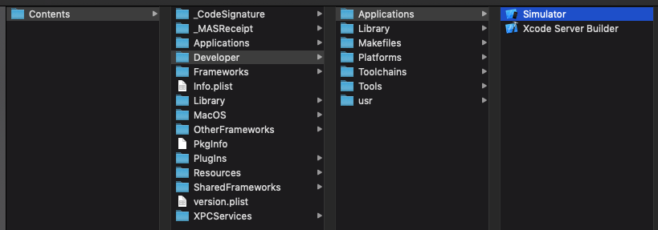
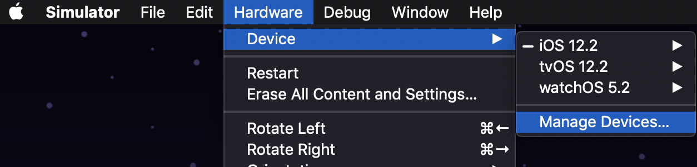
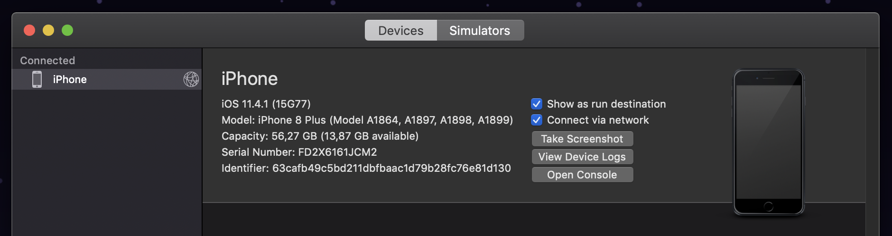
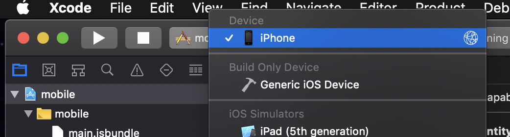

# Emulando React Native via Wi-fi

É possível executarmos o app em nosso dispositivo físico sem conectá-lo via USB sempre, basta seguir os passos abaixo.

## Android

Em breve...

## iOS

Conecte seu dispositivo via USB.

Abra o simulador disponível com a instalação do XCode, para encontrá-lo clique com o botão direito em cima da aplicação XCode, mostrar conteúdo do pacote (Show Package Contents) e siga os passos da imagem:

Depois disso, com o simulador aberto, no menu superior do Mac clique em Hardware > Devices > Manage devices:

Selecione o dispositivo conectado via USB na barra lateral e selecione a opção `Connect via network`:

Depois disso, desconecte o USB, abra algum projeto React Native pelo XCode e na seleção de dispositivos você deve encontrar seu iPhone:

