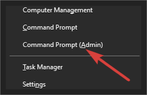

Para configurar o ambiente Android no Windows, vamos precisar instalar 4 dependências: **Node, Python2, JDK e a SDK do Android**.

#### Instalando Chocolatey

Para instalar as libs no Windows, vamos utilizar um gerenciador de pacotes do Windows chamado Chocolatey. Essa ferramenta nos possibilita instalar dependências e ferramentas no sistema com poucos comandos e tudo pelo terminal.

Execute o prompt de comando ou powershell como administrador utilizando a tecla “Windows + X” ou clicando com o botão direito sobre o botão “Iniciar”:



Agora, você deve executar os comandos abaixo de acordo com a **opção que você clicou**:

##### Command Prompt

Caso a opção que você tenha clicado tenha o nome de **Command Prompt**, execute o comando abaixo na janela aberta para instalar o Chocolatey:

```sh
@"%SystemRoot%\System32\WindowsPowerShell\v1.0\powershell.exe" -NoProfile -InputFormat None -ExecutionPolicy Bypass -Command "iex ((New-Object System.Net.WebClient).DownloadString('https://chocolatey.org/install.ps1'))" && SET "PATH=%PATH%;%ALLUSERSPROFILE%\chocolatey\bin"
```

##### Powershell

Caso a opção tenha sido **Powershell**, execute o comando abaixo para verificar se você possui permissões para instalar dependências com o terminal:

```sh
Get-ExecutionPolicy
```

**Se** o retorno desse comando for **“Restricted”**, execute o próximo comando em seu terminal, se não, prossiga para o próximo passo:

```sh
Set-ExecutionPolicy AllSigned
```

Agora, execute o seguinte comando para instalar o Chocolatey:

```sh
Set-ExecutionPolicy Bypass -Scope Process -Force; iex ((New-Object System.Net.WebClient).DownloadString('https://chocolatey.org/install.ps1'))
```

Agora, teste se a instalação ocorreu corretamente executando o seguinte comando no seu terminal (nada irá acontecer, mas não deve retornar erros). Nesse passo pode ser necessário reiniciar seu terminal.

```sh
choco
```

Agora vamos instalar o Node, Python2 e a JDK8 (Java Development Kit 8).

```sh
choco install -y nodejs.install python2 jdk8
```

*Se você tiver o NodeJS já instalado em sua máquina, certifique-se que sua versão é superior à 7 e caso esteja com o JDK instalado em sua máquina, certifique-se que sua versão seja a 8.*

Agora com as dependências instaladas, vamos instalar o CLI (Command Line Interface) do React Native que nos ajudará na criação e teste de novos projetos. Nesse passo você provavelmente deve reiniciar seu terminal para o comando funcionar.

```sh
npm install -g react-native-cli

// Ou yarn global add react-native-cli
```

Se tudo ocorreu bem até aqui, você conseguirá executar o seguinte comando:

```sh
react-native -h
```

Esse comando deve exibir uma lista de comandos possíveis para serem executados com o React Native CLI.
